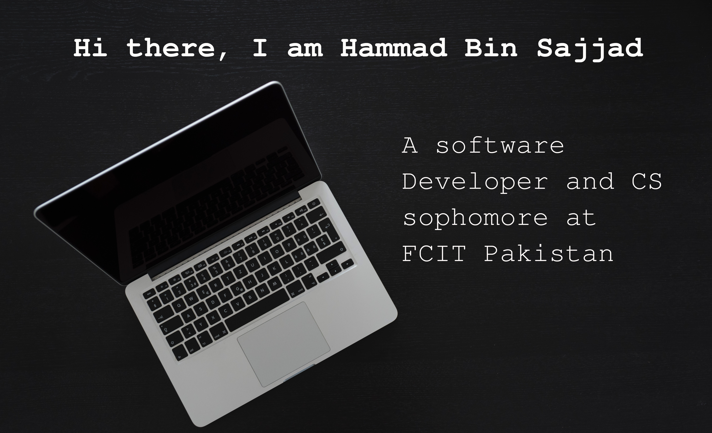

👋 Hello and Assalam o Alikum,

🙋‍♂️ I am Hammad Bin Sajjad, a student of Bachelors in Computer Science in PUCIT/FCIT Lahore, Pakistan.

👨‍🎓 Supposed to graduate in 2024.

👨‍💻 I am just a starter in Coding but is very interested in learning new things about technology and programming.
  Every Programming Language brings something new with it, thus exploring it seems to be brand new adventure.

👉 My interests are Machine Learning, Game Development and Web Development.

🧾 Gaining Experience as I move on in Computer Science and with the help of many online bootcamps I have learned
   a lot of knowledge of different common and uncommon career/ fields in Computer Science.
   
💥 Collaboration on some online resources (like CS50) if seemed to be possible is highly appreciated.

🥰 Well, thanks a lot for visiting my profile. 

Stay Safe - Stay Happy - Stay Coding - Stay Developing - Stay Debugging 
